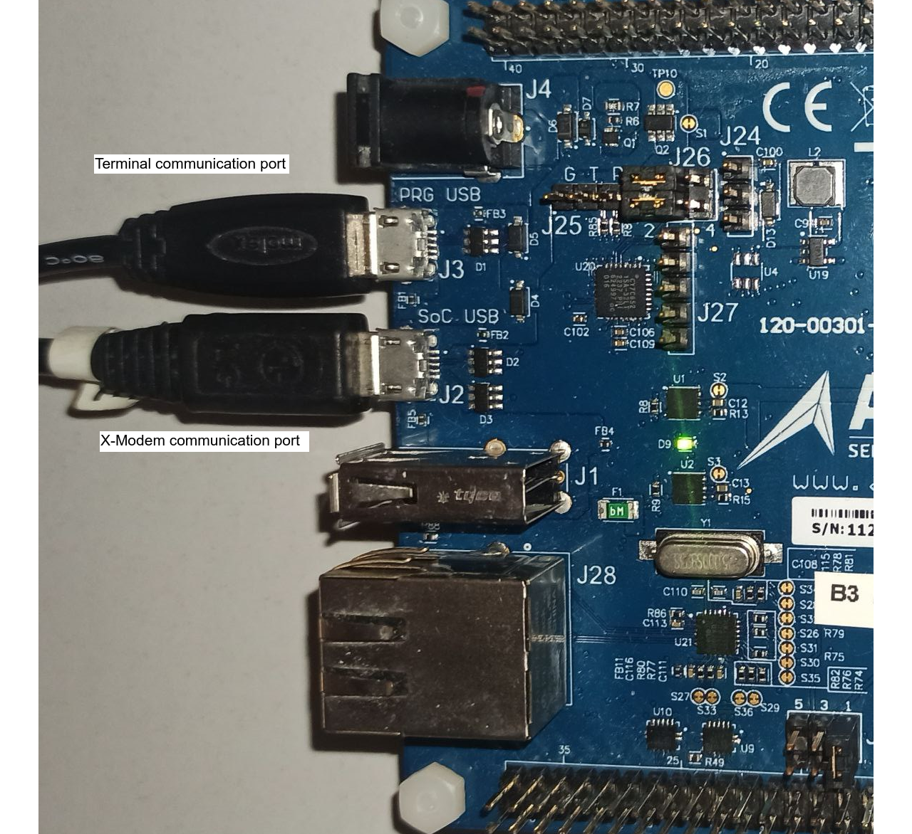
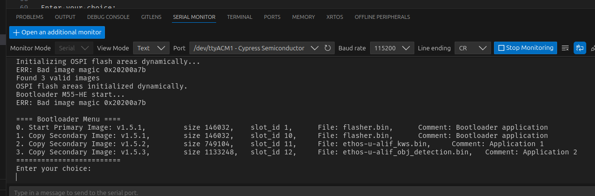
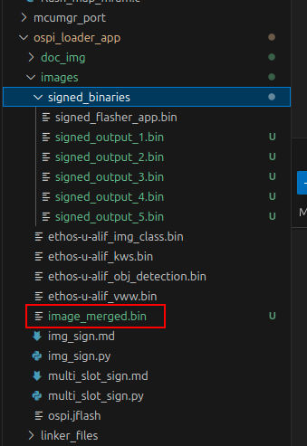
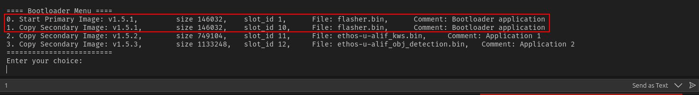
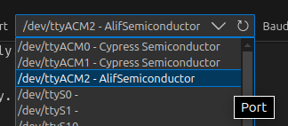
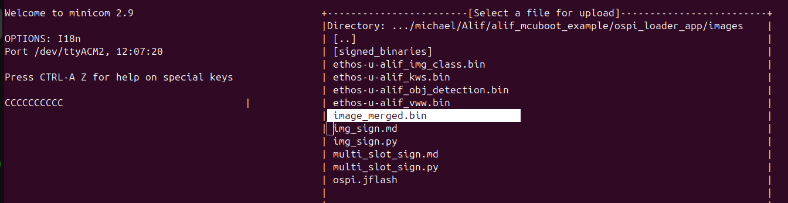
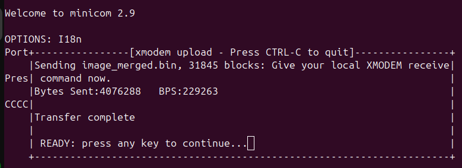

# User Guide for AI/ML Application Loader

## Overview

This guide provides users with a step-by-step approach to preparing and uploading AI/ML applications to the Alif Ensemble DevKit. The system is designed to allow seamless execution of AI/ML application examples without requiring frequent firmware reflashing.

Key Features:

Preloaded Applications: AI/ML applications are stored in external OSPI flash and dynamically loaded into internal memory for execution.

User-Friendly Interface: A bootloader menu enables users to select and run applications directly from storage.

Efficient File Management: Applications are uploaded as merged binary files, ensuring easy updates and execution.

By following this guide, users can efficiently upload, manage, and execute AI/ML models, maximizing the potential of the Alif Ensemble DevKit for various machine learning tasks.


---

## Key Features

- **Dynamic Application Loading**:
  - Applications are stored in external OSPI flash.
  - Users can load applications into the primary memory slot (internal flash) and execute them directly.
- **Menu-Based Application Selection**:
  - The device displays a loader menu upon startup.
  - Users can choose from:
    - `0`: Run the pre-flashed application in internal memory.
    - `1, 2, 3, ...`: Load and run AI/ML applications stored in external memory.
- **Preloaded AI/ML Examples**:
  - Examples include models for object detection, keyword spotting, and more.
  - Applications are optimized for the Ensemble platform's neural processing capabilities.

---

## Purpose

The goal of this project is to provide a flexible, user-friendly environment for evaluating the performance of the Alif Ensemble DevKit with various AI/ML applications. By leveraging the dynamic loading mechanism, users can:

- Experiment with different AI/ML use cases.
- Quickly switch between applications without firmware updates.
- Maximize the potential of the platform for diverse machine learning tasks.

---

## Quick Reference Table for update applications list

| Step | Action |
|------|--------|
| 1 | Power on the Alif Ensemble DevKit and press the reset button. |
| 2 | Select the Flasher Application from the loader menu. |
| 3 | Run the Flasher App and observe the LED sequence (Red -> Green -> Off). |
| 4 | Connect the board via USB and identify the correct port (`/dev/ttyACMx`). |
| 5 | Open a terminal emulator (`minicom -D /dev/ttyACMx`). |
| 6 | Transfer the merged firmware using `XModem`. |
| 7 | Verify the transfer and reboot the board to see the updated loader menu. |

---

## Quick Start Guide

### 1. Setup the Development Kit

- Ensure the Alif Ensemble DevKit is connected to your computer via USB.
  
- Use a terminal emulator such as [Tera Term](https://teratermproject.github.io/index-en.html) or `minicom` (Linux) to upoload applications (using X-Modem protocol) with the board.
- Configure the communication terminal to use the appropriate serial port with a baud rate of `115200`.
  

### 2. Loader Menu

Upon powering the device, the loader displays a menu similar to:

```
==== Bootloader Menu ====
0. Start Primary Image: v1.5.1, size 145712, slot_id 1, File: flasher.bin, Comment: Bootloader application
1. Copy Secondary Image: v1.5.1, size 145712, slot_id 10, File: flasher.bin, Comment: Bootloader application
2. Copy Secondary Image: v1.5.2, size 749104, slot_id 11, File: ethos-u-alif_kws.bin, Comment: Application 1
3. Copy Secondary Image: v1.5.3, size 1133248, slot_id 12, File: ethos-u-alif_obj_detection.bin, Comment: Application 2
=========================
Enter your choice:
```

- Press `0` to run the default application stored in internal memory.
- Press `1, 2, 3...` copy from external OSPI flash to internal memory and run an application .

---

## Updating Loader Menu Using the Flasher App

The loader menu displays a list of applications stored in external OSPI flash memory (positions 1...N).
If you need to update the list of applications in OSPI flash, follow these steps:

### Step 1: Prepare and signing Applications Before Flashing
Before merging applications, each binary file must be signed to ensure compatibility. This is done using a Python script.

1. Open a terminal and navigate to the `ospi_loader_app/images` directory.

To sign and merge multiple application binaries into a single image file, use the following command:
```bash
python3 multi_slot_sign.py \
~/Alif/alif_usb-to-ospi-flasher/out/flasher/HE/debug/flasher.bin \
ethos-u-alif_kws.bin ethos-u-alif_obj_detection.bin \
--versions 1.5.1 1.5.2 1.5.3 \
--comments "Bootloader application" "Application 1" "Application 2" \
--merged_output image_merged.bin
```
> **Note:** Each merged file **must include** `flasher application` (flasher.bin). Without it, the OSPI flash update will be impossible, requiring a J-Link programmer.
> Verify that all signed binaries appear in the `signed_binaries` folder.



#### Step 2: Select the Flasher Application
1. Power on the device and use the bootloader menu.
2. Select the `flasher` application (e.g., option `0` or `1`). In case `0` - loader application just run from internal flash. 
In case `1` - loader application will copy to internal flash and then run from internal flash.


#### Step 2: Run the Flasher Application
1. Once the flasher application is running, observe the LED sequence:
   - **Red -> Green -> Off**: Indicates successful startup of the flasher application.

#### Step 3: Connect the Host System
1. Connect a USB cable to the micro-USB port (J2) on the Alif Ensemble DevKit.
2. Identify the USB device on your host system. It typically appears as `/dev/ttyACMx` (where `x` can be `2`, `3`, etc.).

#### Step 4: Start a Terminal Emulator
1. Open a terminal emulator such as `minicom`:
   ```bash
   minicom -D /dev/ttyACMx
   ```
2. Replace `/dev/ttyACMx` with the correct port for your device.


#### Step 5: Transfer Firmware to OSPI Flash
1. Press `Ctrl-A`, then `S` to open the file transfer menu in `minicom`.
2. Select `XModem` as the transfer protocol.
3. Choose the merged binary file (`image_merged.bin`).

4. Confirm and wait for the transfer to complete.


#### Step 6: Verify the Transfer
1. Observe the terminal for success messages from the flasher application.
2. If no errors are reported, the firmware has been successfully written to the OSPI flash.

#### Step 7: Restart and Validate
1. Press the reset button on the board.
2. The bootloader menu should now display the newly added applications.

---

## System Architecture

### Memory Layout Diagram

```
+---------------------------+
| Internal MRAM (Primary)   |
| - Currently running app   |
+---------------------------+
| External OSPI Flash       |
| - Preloaded AI/ML Apps    |
+---------------------------+
```

- **External OSPI Flash**:
  - Located in internal MRAM.
  - Runs the currently active application.
- **Secondary Slots**:
  - Stored in external OSPI flash.
  - Contain preloaded AI/ML application images.

### Loader Workflow

1. **Initialization**:
   - The loader initializes MRAM and OSPI flash.
   - Dynamically scans and validates images in OSPI flash.
2. **Menu Display**:
   - Reads metadata from each image and displays a selection menu.
3. **Application Execution**:
   - Copies the selected image into MRAM.
   - Validates and executes the image.

---

## Supported AI/ML Applications

The preloaded applications demonstrate various AI/ML capabilities, such as:

- **Keyword Spotting**:
  - Detects specific spoken keywords.
- **Object Detection**:
  - Identifies and classifies objects in images.
- **Other Use Cases**:
  - Custom AI/ML tasks tailored to the platform.

---

## Compilation applications for AI/ML Loader Execution

### Memory Map Requirements for applications

To ensure compatibility with the loader, each applications must adhere to the following memory map:

- **Memory Configuration**:
  ```
  MEMORY
  {
    DTCM  (rwx) : ORIGIN = 0x20000000, LENGTH = 0x00040000
    SRAM0 (rwx) : ORIGIN = 0x02000000, LENGTH = 0x00400000
    MRAM  (rx)  : ORIGIN = 0x80010800, LENGTH = 0x00476800
  }
  ```

- **Section Allocation**:
  - Startup code and read-only data are placed in MRAM.
  - Executable code (.text) resides in MRAM.
  - Initialized data (.data) is loaded into DTCM and copied from MRAM at runtime.
  - Uninitialized data (.bss) is allocated in DTCM.
  - Application-specific heap is configured in SRAM0.

- **Snippet Linker Script for applications**:
  ```
  SECTIONS
  {
    .startup : ALIGN(16) {
      KEEP(*(.vectors))
      KEEP(*(.init))
      KEEP(*(.fini))
      *(.rodata*)
    } > MRAM

    .text : ALIGN(16) {
      *(.text*)
    } > MRAM

    .data : ALIGN(16) {
      __data_start__ = .;
      *(.data)
      __data_end__ = .;
    } > DTCM AT > MRAM

    .bss (NOLOAD) : ALIGN(8) {
      __bss_start__ = .;
      *(.bss)
      __bss_end__ = .;
    } > DTCM

    .stack (NOLOAD) : ALIGN(8) {
      __StackLimit = .;
      . = . + __STACK_SIZE;
      __StackTop = .;
    } > DTCM
  }
  ```

### Compilation Steps

1. Configure the linker script to match the loader’s memory requirements.
2. Compile the application using the appropriate toolchain (e.g., GCC Arm).
3. Use `imgtool.py` (see ospi_loader_app/images/img_sign.md) to sign the compiled binary and add the necessary header.
4. Verify the final binary with the loader’s validation tools (if available).

---

## Advantages

- **Ease of Use**:
  - Simplifies testing AI/ML models on the Ensemble platform.
- **Flexibility**:
  - Quickly switch between applications without firmware reflashing.
- **Performance Evaluation**:
  - Enables users to measure the performance of the platform with different AI/ML tasks.

---

## Troubleshooting

- **Bootloader Errors**:
  - Ensure that the OSPI flash is correctly programmed.
  - Check for metadata issues if images are not displayed in the menu.
- **Communication Issues**:
  - Verify the terminal emulator settings (baud rate, serial port, etc.).
- **Flasher Application**:
  - Ensure the XMODEM protocol is correctly configured.

---

## Additional Resources

- [MCUboot Documentation](https://docs.mcuboot.com/)
- [Merged image creation](images/multi_slot_sign.md)